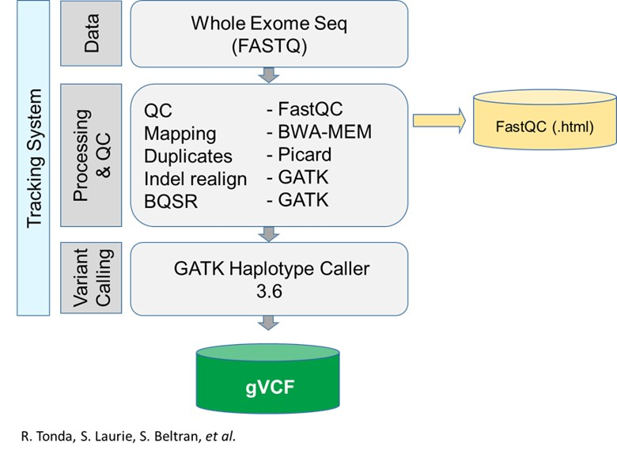
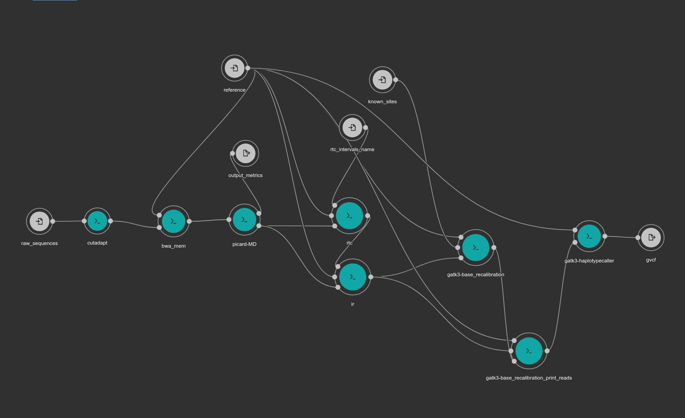

## Wetlab2Variations Workflow Demonstrator

Rare disease researchers’ workflow is that they submit their raw data (fastq), run the mapping and variant calling RD-Connect pipeline and obtain unannotated gvcf files to further submit to the RD-Connect GPAP or analyse on their own.

This demonstrator focuses on the variant calling pipeline. The raw genomic data is processed using the RD-Connect pipeline ([Laurie et al., 2016](https://www.ncbi.nlm.nih.gov/pubmed/27604516)) running on the standards (GA4GH) compliant, interoperable container orchestration platform.

This demonstrator will be aligned with the current implementation study on [Development of Architecture for Software Containers at IECHOR and its use by EXCELERATE use-case communities](docs/Appendix%201%20-%20Project%20Plan%202018-biocontainers%2020171117.pdf) 

For this implementation, different steps are required:

1. Adapt the pipeline to CWL and dockerise elements 
2. Align with IS efforts on software containers to package the different components (Nextflow) 
3. Submit trio of Illumina NA12878 Platinum Genome or Exome to the GA4GH platform cloud (by Aspera or ftp server)
4. Run the RD-Connect pipeline on the container platform
5. Return corresponding gvcf files
6. OPTIONAL: annotate and update to RD-Connect playground instance

N.B: The demonstrator might have some manual steps, which will not be in production. 

## RD-Connect pipeline

Detailed information about the RD-Connect pipeline can be found in [Laurie et al., 2016](https://www.ncbi.nlm.nih.gov/pubmed/?term=27604516)

## The applications

1. **Name of the application: Adaptor removal**  
Function: remove sequencing adaptors   
Container (readiness status, location, version): [cutadapt (v.1.18)](https://hub.docker.com/r/cnag/cutadapt)  
Required resources in cores and RAM: current container size 169MB  
Input data (amount, format, directory..): raw fastq  
Output data: paired fastq without adaptors  

2. **Name of the application: Mapping and bam sorting**  
Function: align data to reference genome  
Container : [bwa-mem (v.0.7.17)](https://hub.docker.com/r/cnag/bwa) / [Sambamba (v. 0.6.8 )](https://hub.docker.com/r/cnag/sambamba)(or samagents)  
Resources :current container size 111MB / 32MB  
Input data: paired fastq without adaptors  
Output data: sorted bam  

3. **Name of the application: MarkDuplicates**  
Function: Mark (and remove) duplicates  
Container: [Picard (v.2.18.25)](https://hub.docker.com/r/cnag/picard)
Resources: current container size 261MB  
Input data:sorted bam  
Output data: Sorted bam with marked (or removed) duplicates  

4. **Name of the application: Base quality recalibration (BQSR)**  
Function: Base quality recalibration  
Container: [GATK (v.3.6-0)](https://hub.docker.com/r/cnag/gatk)
Resources: current container size 270MB  
Input data: Sorted bam with marked (or removed) duplicates  
Output data: Sorted bam with marked duplicates & base quality recalculated  

5. **Name of the application: Variant calling**  
Function: variant calling  
Container: [GATK (v.3.6-0)](https://hub.docker.com/r/cnag/gatk)
Resources: current container size 270MB  
Input data:Sorted bam with marked duplicates & base quality recalculated  
Output data: unannotated gvcf per sample  

6. **(OPTIONAL)Name of the application: Quality of the fastq**  
Function: report on the sequencing quality  
Container: [fastqc 0.11.8](https://hub.docker.com/r/cnag/fastqc)
Resources: current container size 173MB  
Input data: raw fastq  
Output data: QC report 

## Licensing

GATK declares that archived packages are made available for free to academic researchers under a limited license for non-commercial use. If you need to use one of these packages for commercial use. https://software.broadinstitute.org/gatk/download/archive 
